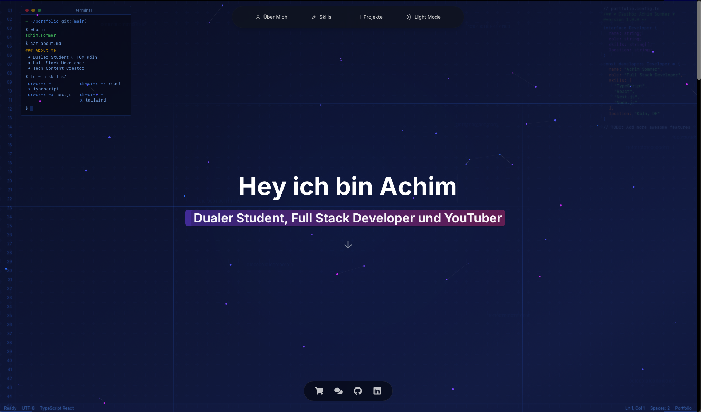

# Next.js Portfolio 🚀

[](https://choosealicense.com/licenses/mit/)
[](https://nextjs.org/)
[](https://www.typescriptlang.org/)
[](https://tailwindcss.com/)
[](https://wakatime.com/badge/user/677681b3-49a8-4ab2-a967-cffb857c9d96/project/82699207-ba17-409d-9023-5bde06558a42)

Ein modernes, performantes Portfolio entwickelt mit Next.js und TypeScript. Live Demo: [https://achimsommer.com](https://achimsommer.com)



## ✨ Features

### 🎨 Design & UI
- Responsives Design für alle Geräte
- Dark/Light Mode mit System-Präferenz
- Smooth Scroll & Animationen
- Moderne UI/UX mit Tailwind CSS
- Interaktive 3D Komponenten
- Particle Effekte & Animationen

### 🛠 Technische Features
- Server-Side Rendering (SSR)
- API Routes für GitHub & WakaTime Integration
- TypeScript für type-safety
- Optimierte Performance (100/100 Lighthouse Score)
- SEO optimiert mit Next.js Metadata
- Progressive Web App (PWA) fähig
- Datenschutzfreundliche Analytics mit Umami

### 📱 Komponenten
- Interaktive Projekt-Showcase
- Skill-Visualisierung
- GitHub Repository Integration
- WakaTime Statistiken
- Kontaktformular
- Social Media Integration
- Floating Navigation
- 3D Tech Stack Visualisierung

## 🛠 Technologie-Stack

### Frontend
- **Framework:** Next.js 14
- **Sprache:** TypeScript
- **Styling:** Tailwind CSS
- **Animationen:** Framer Motion
- **3D Effekte:** Custom 3D Komponenten
- **Icons:** Tabler Icons, React Icons

### Backend & APIs
- **API Routes:** Next.js API Routes
- **Externe APIs:** 
  - GitHub API (Repositories)
  - WakaTime API (Coding Stats)
  - Umami Analytics (Selbst-gehostet)

### Deployment & Hosting
- **Primäre Option:** [Zap-Hosting](https://zap-hosting.com/) mit [Coolify](https://coolify.io/)
  - Selbst-gehostete Alternative zu Vercel
  - Volle Kontrolle über die Infrastruktur
  - Einfaches Deployment via Git
  - Automatische SSL-Zertifikate
  - Integriertes Monitoring

- **Alternative:** Vercel
  - Automatisches Deployment
  - Edge Network
  - Analytik & Monitoring

### 🔍 SEO-Konfiguration

Das Portfolio ist mit einer dynamischen XML-Sitemap und robots.txt für optimale Suchmaschinenindexierung ausgestattet.

#### Sitemap
- Automatisch generierte XML-Sitemap unter `/sitemap.xml`
- Dynamische Aktualisierung der Seiten
- Automatische `lastmod` Daten

#### robots.txt
- Suchmaschinen-Crawler Konfiguration
- Sitemap-Referenz für bessere Indexierung

#### Domain-Konfiguration
Um die SEO-Funktionen für deine Domain zu aktivieren:

1. In `public/robots.txt` die Sitemap-URL anpassen:
```txt
Sitemap: https://deine-domain.com/sitemap.xml
```

2. In `pages/sitemap.xml.tsx` die Domain-Konstante aktualisieren:
```typescript
const EXTERNAL_DATA_URL = 'https://deine-domain.com'
```

Diese SEO-Optimierungen verbessern die Sichtbarkeit deiner Portfolio-Website in Suchmaschinen.

### 🔍 SEO-Konfiguration

Das Portfolio ist mit umfassenden SEO-Optimierungen ausgestattet, einschließlich strukturierter Daten, dynamischer OG-Images und Meta-Tags.

#### Wichtige SEO-Dateien

- `pages/_app.tsx`: Zentrale App-Komponente mit SEO-Integration
- `pages/api/og.tsx`: Dynamische Open Graph Image Generierung
- `src/components/JsonLd.tsx`: Strukturierte Daten (Schema.org)
- `src/config/seo.config.ts`: Zentrale SEO-Konfiguration
- `public/robots.txt`: Crawler-Konfiguration
- `pages/sitemap.xml.tsx`: Dynamische Sitemap

#### Anpassung der SEO-Konfiguration

1. **Basis SEO-Konfiguration** (`src/config/seo.config.ts`):
```typescript
// Passe diese Werte an deine Website an
{
  titleTemplate: '%s | Dein Name',
  defaultTitle: 'Dein Name | Portfolio',
  description: 'Deine Beschreibung',
  openGraph: {
    url: 'https://deine-domain.com/',
    siteName: 'Dein Portfolio Name',
    // ...
  }
}
```

2. **Strukturierte Daten** (`src/components/JsonLd.tsx`):
```typescript
// Aktualisiere die persönlichen Informationen
{
  name: "Dein Name",
  url: "https://deine-domain.com",
  jobTitle: "Deine Position",
  description: "Deine Beschreibung",
  sameAs: [
    "https://github.com/dein-username",
    "https://linkedin.com/in/dein-username"
  ],
  // Bildungseinrichtung anpassen
  alumniOf: {
    name: "Deine Universität",
    // ...
  }
}
```

3. **Open Graph Image** (`pages/api/og.tsx`):
```typescript
// Passe das Design des OG-Images an
{
  // Ändere Text und Styling
  name: "Dein Name",
  role: "Deine Position",
  // Passe Farben und Layout an
  background: "deine-farbe",
  // ...
}
```

#### SEO Best Practices

1. **Meta-Tags**:
   - Stelle sicher, dass alle Seiten eindeutige Titel haben
   - Schreibe aussagekräftige Beschreibungen
   - Nutze relevante Keywords natürlich im Content

2. **Strukturierte Daten**:
   - Halte die persönlichen Informationen aktuell
   - Füge alle relevanten Social Media Profile hinzu
   - Aktualisiere Bildungs- und Berufsinformationen

3. **Open Graph**:
   - Teste das OG-Image mit Social Media Debuggern
   - Stelle sicher, dass die Vorschau auf allen Plattformen gut aussieht

4. **Sitemap & Robots**:
   - Aktualisiere die Sitemap bei neuen Seiten
   - Überprüfe die robots.txt Konfiguration

#### Validierung

Nutze diese Tools zur Überprüfung deiner SEO-Implementierung:
- [Google Rich Results Test](https://search.google.com/test/rich-results)
- [Facebook Sharing Debugger](https://developers.facebook.com/tools/debug/)
- [Twitter Card Validator](https://cards-dev.twitter.com/validator)
- [LinkedIn Post Inspector](https://www.linkedin.com/post-inspector/)

## 🚀 Schnellstart

### Voraussetzungen
- Node.js 18+ installiert
- Git installiert
- GitHub Account
- WakaTime Account (optional)

### Installation

1. Repository klonen
```bash
git clone https://github.com/yourusername/nextjs-portfolio.git
```

2. In das Projektverzeichnis wechseln
```bash
cd nextjs-portfolio
```

3. Abhängigkeiten installieren
```bash
npm install
```

4. Umgebungsvariablen konfigurieren
```bash
cp .env.example .env.local
```
Fülle die Variablen in `.env.local` aus:
```env
GITHUB_TOKEN=dein_github_token
WAKATIME_API_KEY=dein_wakatime_api_key
NEXT_PUBLIC_UMAMI_WEBSITE_ID=dein_umami_website_api_key
NEXT_PUBLIC_UMAMI_URL=https://ihre-umami-domain.com/script.js
```

5. Entwicklungsserver starten
```bash
npm run dev
```

6. Browser öffnen
```
http://localhost:3000
```

## 📁 Projektstruktur

```
├── public/              # Statische Assets
│   ├── img/            # Bilder & Icons
│   └── ...
├── src/
│   ├── app/            # App Router Pages
│   │   ├── api/        # API Routes
│   │   └── ...
│   ├── components/     # React Komponenten
│   │   ├── 3d/        # 3D Komponenten
│   │   ├── tabs/      # Tab Komponenten
│   │   └── ui/        # UI Komponenten
│   ├── context/       # React Context
│   ├── lib/           # Hilfsfunktionen
│   └── utils/         # Utility Funktionen
```

## 🌐 Deployment mit Zap-Hosting & Coolify

1. Server bei [Zap-Hosting](https://zap-hosting.com/) mieten
2. Coolify auf dem Server installieren
```bash
curl -fsSL https://cdn.coollabs.io/coolify/install.sh | bash
```
3. Coolify einrichten:
   - Repository verbinden
   - Umgebungsvariablen setzen
   - Build-Einstellungen konfigurieren
4. Deployment starten

### Deployment Konfiguration
```yaml
Build Command: npm run build
Start Command: npm start
Node Version: 18
Port: 3000
```

## 💻 Development

### Best Practices
- Komponenten modular halten
- TypeScript strict mode nutzen
- Tailwind Klassen mit @apply organisieren
- Images optimieren
- Lazy Loading für große Komponenten
- regelmäßige Dependency Updates

### Code Style
- ESLint für konsistenten Code
- Prettier für Formatierung
- TypeScript für Type Safety

## 🔨 Scripts

- `npm run dev` - Entwicklungsserver starten
- `npm run build` - Produktions-Build erstellen
- `npm run start` - Produktionsserver starten
- `npm run lint` - Code-Linting durchführen
- `npm run format` - Code formatieren

## 📝 Lizenz

Dieses Projekt ist unter der [MIT Lizenz](LICENSE.md) lizenziert.

## 🤝 Beitragen

Beiträge sind willkommen! Bitte beachte:
1. Fork das Projekt
2. Erstelle einen Feature Branch
3. Committe deine Änderungen
4. Push zu dem Branch
5. Öffne einen Pull Request

## 📧 Kontakt

Bei Fragen oder Anregungen kannst du:
- Ein Issue erstellen
- Einen Pull Request öffnen
- Mich direkt kontaktieren

## 🙏 Danksagung

Besonderer Dank geht an:
- Next.js Team für das großartige Framework
- Zap-Hosting für zuverlässiges Hosting
- Coolify für die Self-Hosting Lösung

### 🎨 Logo & PWA Assets

Das Portfolio kommt mit einem automatisierten System zur Generierung von Logos und PWA-Assets.

#### Logo Generator

Das Logo wird automatisch aus einem SVG-Template generiert. Du kannst es einfach an deine Bedürfnisse anpassen:

1. **Base Logo anpassen** (`scripts/generate-base-logo.js`):
```javascript
// Passe diese Werte an:
- Initialen im SVG-Text
- Farben im Gradienten
- Größen und Positionen
- Hintergrund-Code-Snippets
- Untertitel
```

2. **Base Logo generieren**:
```bash
node scripts/generate-base-logo.js
```

#### PWA Assets

Alle PWA-Assets werden automatisch aus dem Base Logo generiert:

1. **Assets generieren** (`scripts/generate-pwa-assets.js`):
```bash
node scripts/generate-pwa-assets.js
```

Dies erstellt:
- Icons in verschiedenen Größen (72x72 bis 512x512)
- Apple Touch Icon
- Favicon

#### Anpassung der Assets

1. **Logo-Design**: 
   - Öffne `scripts/generate-base-logo.js`
   - Passe die SVG-Template-Strings an
   - Ändere Farben, Texte und Größen
   - Führe das Script aus

2. **PWA-Manifest** (`public/manifest.json`):
   - Aktualisiere den App-Namen
   - Passe die Farben an
   - Konfiguriere Start-URL und Scope

3. **Icon-Größen**: 
   - Standardmäßig werden alle gängigen Größen generiert
   - Bei Bedarf können in `scripts/generate-pwa-assets.js` weitere Größen hinzugefügt werden

#### Best Practices

1. **Qualität**:
   - Verwende das Base Logo in hoher Auflösung (1024x1024)
   - Teste die Icons in verschiedenen Kontexten
   - Überprüfe die Lesbarkeit in kleinen Größen

2. **Konsistenz**:
   - Halte das Design über alle Größen hinweg konsistent
   - Verwende die gleichen Farben wie in deinem Portfolio
   - Stelle sicher, dass das Logo zur Markenidentität passt

3. **Testing**:
   - Teste die PWA-Installation auf verschiedenen Geräten
   - Überprüfe das Erscheinungsbild auf dem Homescreen
   - Validiere das Web App Manifest
