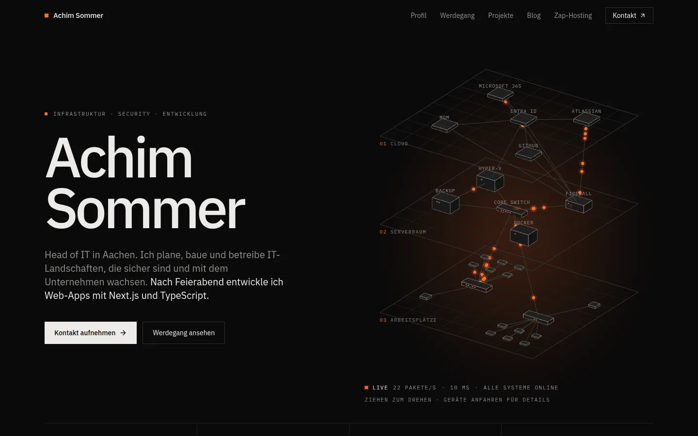

# Next.js Portfolio

[](LICENSE.md)
[](https://nextjs.org/)
[](https://www.typescriptlang.org/)
[](https://tailwindcss.com/)

Portfolio und Blog von Achim Sommer. Live: [achimsommer.com](https://achimsommer.com)



## Funktionen

- **Startseite** mit 3D-Netzwerk im Hero (React Three Fiber) und einem Ausweis am Umhängeband, der sich mit der Maus ziehen lässt
- **Aktivitätskalender**, der GitHub- und GitLab-Beiträge zusammenführt (`/api/contributions`)
- **Blog** aus Markdown/MDX mit Tag-Seiten, Inhaltsverzeichnis, Lesefortschritt, Suche und Filter
- **Interaktive Artikel-Bausteine**: RAM-Rechner, Break-even-Diagramm, Tabellen, Hinweisboxen, Codeblöcke
- **Eigene Rechner-Seite** unter `/server-ram-rechner`
- **Landingpages** für Palworld und FiveM
- **Kontaktformular** über Resend
- **PWA** mit Offline-Seite (Serwist)
- **SEO**: strukturierte Daten (Person, WebSite, BlogPosting, Breadcrumbs, FAQ), Sitemap mit Änderungsdatum, RSS, Vorschaubilder pro Artikel
- **Analytics** datenschutzfreundlich mit Umami

## Technik

| Bereich | Einsatz |
| --- | --- |
| Framework | Next.js 16 (App Router für Startseite und Rechtliches, Pages Router für Blog und Landingpages) |
| Sprache | TypeScript, React 19 |
| Styling | Tailwind CSS 3, IBM Plex über `next/font` |
| 3D und Animation | React Three Fiber, Framer Motion |
| Inhalte | MDX mit next-mdx-remote, remark-gfm, rehype-slug |
| Bilder | sharp (Vorschaubilder aus Diagrammen) |
| Hosting | Coolify auf eigenem Server |

## Schnellstart

```bash
git clone https://github.com/Achim-Sommer/nextjs-portfolio.git
cd nextjs-portfolio
npm install
cp .env.example .env.local   # Werte eintragen
npm run dev
```

Danach läuft die Seite unter http://localhost:3000.

### Umgebungsvariablen

| Variable | Zweck |
| --- | --- |
| `NEXT_PUBLIC_SITE_URL` | Kanonische Domain, z. B. `https://achimsommer.com` |
| `GITHUB_TOKEN` | Repositories und Beiträge von GitHub |
| `NEXT_PUBLIC_UMAMI_URL`, `NEXT_PUBLIC_UMAMI_WEBSITE_ID` | Umami-Tracking (optional) |
| `RESEND_API_KEY`, `CONTACT_FROM_EMAIL`, `CONTACT_TO_EMAIL` | Kontaktformular |

## Blogartikel schreiben

1. Neue Datei in `content/blog/<slug>.md` anlegen.
2. Frontmatter ausfüllen:

```yaml
---
title: 'Titel des Artikels'
description: 'Beschreibung für Google, 140 bis 160 Zeichen'
date: '2026-10-02'
lastModified: '2026-10-02'
tags: ['Self-Hosting', 'Docker']
featured: false
---
```

3. Im Text stehen diese Komponenten zur Verfügung:

```mdx
<Figure src="/img/blog/<slug>/bild.webp" alt="..." width={1600} height={900} caption="..." />
<Tip>Hinweis</Tip>
<ZapHostingCta href="..." title="..." description="..." buttonText="..." />
<RamRechner />
<BreakEvenChart initial="vserver" />
```

Das erste `<Figure>` eines Artikels wird beim Build automatisch zum Vorschaubild für Google und soziale Netzwerke (`scripts/og-from-diagrams.mjs`). Preise für Break-even-Diagramm und Tabellen stehen zentral in `src/data/hosting-prices.ts`.

## Scripts

| Befehl | Zweck |
| --- | --- |
| `npm run dev` | Entwicklungsserver |
| `npm run build` | Produktions-Build (erzeugt vorher die Vorschaubilder) |
| `npm run start` | Produktionsserver |
| `npm run lint` | ESLint |
| `npm run og-images` | Vorschaubilder aus Diagrammen neu erzeugen |
| `npm run generate-pwa-assets` | App-Icons aus dem Logo erzeugen |

## Lizenz

MIT, siehe [LICENSE.md](LICENSE.md).
